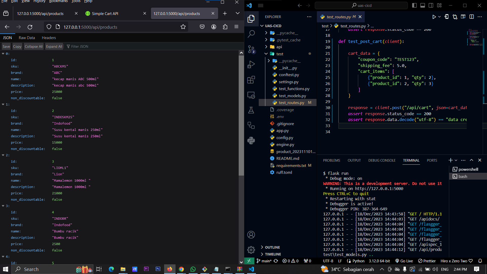
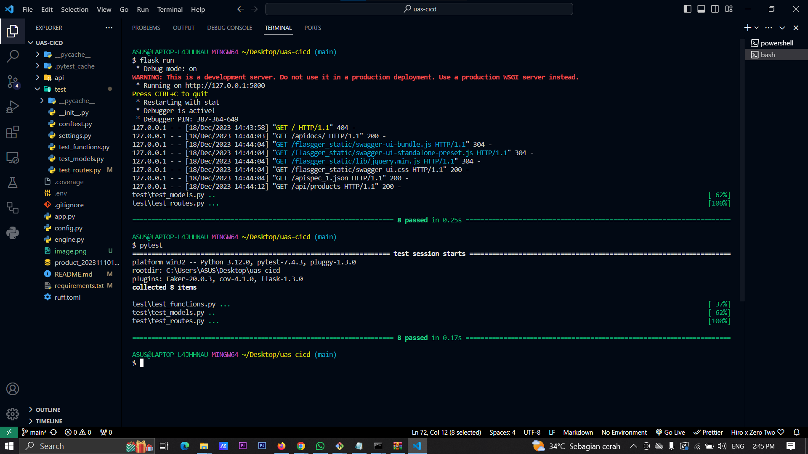

# SimpleCart
implement simple cart and promotion

# Setup Guide

## Install, create and activate virtualenv
https://medium.com/analytics-vidhya/virtual-environment-6ad5d9b6af59

## Install requirements

    pip install -r requirements.txt
## create database
create new database, in this case we're using postgresql

## set env variable

create file .env in the root of the folder, and fill with you credential of your database

      
    DB_USER = ""
    DB_PASSWORD = ""
    DB_HOST = ""
    DB_PORT = ""
    DB_NAME = ""
    FLASK_DEBUG = true

## Create table

run `flask create`to create tables from models.

## Insert data product

run this query from your db client
```
INSERT INTO public.product (sku,brand,"name",description,price,non_discountable) VALUES
	 ('ABCKM5','ABC','kecap manis ABC 500ml','kecap manis abc 500ml',25000.0,false),
	 ('INDOSKM25','Indofood','Susu kental manis 250ml','Susu kental manis 250ml',15000.0,false),
	 ('LIOML1','Lion','Mamalemon 1000ml ','Mamalemon 1000ml ',21000.0,false),
	 ('INDOBR','Indofood','Bumbu racik','Bumbu racik',2500.0,false),
	 ('ABCS25','ABC','Sambal 250ml','Sambal 250ml',15000.0,false),
	 ('INDOIGS','Indofood','Indomie goreng special','Indomie goreng special',3000.0,false),
	 ('MYRLM1','mayora','le minerale 1000ml','le minerale 1000ml',8000.0,true);
```

## Run the app
to run the web app simply  use

    flask run

to access swagger use url `localhost:5000/apidocs`


## Run test
run test

    pytest

check test coverage

    pytest --cov=myproj tests/


## Debt

 - Cart Update
 - Same product validation on cart
 - Unit test
 - Unit test coverage
 - CI setup 

 
